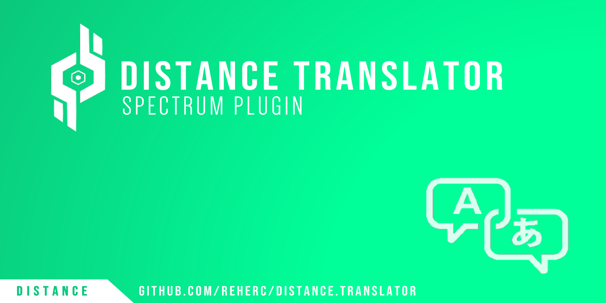

# Distance Translator
> **A Spectrum plugin meant to allow peoples to translate the game with custom language files**

# Status
> 
> 
> 
> 
> 

# Download the mod
> You can download the mod from the [Releases page](https://github.com/REHERC/Distance.Translator/releases/latest)

# Unstable builds
> You can download unstable builds from the [AppVeyor artifacts page](https://ci.appveyor.com/project/REHERC/distance-translator/build/artifacts)

# Technologies used
> 
> 
> 

# Special thanks
> Big thanks to all of you 
>  
>  
> &message=iOnTempest&color=056194) 
> &message=NFSLYY&color=056194) 
> &message=vVEkIVv&color=056194) 
> &message=Ulvind&color=056194) 
> &message=Brionac&color=056194) 
> &message=Tomato78&color=056194) 
>  
> 
If you helped me and i forgot to list you on this page, send me a message on discord and i'll add you.
